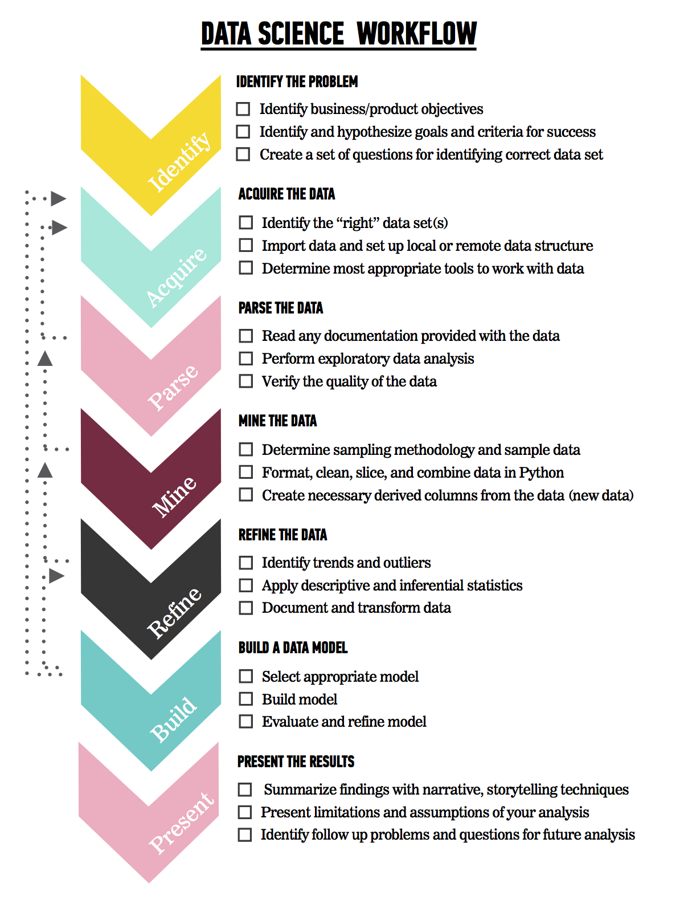

# Preprocessing in sklearn

Before you embark on the attached lab, take a second to refresh your memory about the data science workflow:

Where in the process would these libraries come in most handy? Check in with your classmates and your local instructor to double check your understanding. Preprocessing libraries offer a pretty high level of power at the cost of some flexibility and having to use numpy arrays instead of pandas dataframes. This means that while it may not be the best choice for iteration and *creating* models, it may be a great fit for *productionalizing* models. 

Don't forget, you should always assess the tools and the skills we've learned in the following areas:

1. What is it used for?
2. When is it *best* used?
3. When is it less useful?

If you aren't able to answer those questions about the tools you've learned (like preprocessing libraries), this is a case where you should ask your classmates, your local instructor, or your global instructors -- knowing when to use a tool is just as important as knowing what the tool does!

## The Lab

You'll find today's lab in `preprocessing_lab.ipynb`. Our expectation is that you'll complete all the questions that are not marked **Bonus**. If you find yourself with extra time today, please feel free to solve the supplied **Bonus** questions or use the remaining time appropriately (researching for potential Capstone projects or preparing Project 2 for submission at the end of the day!)

Happy Coding!